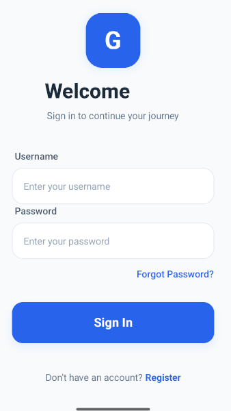
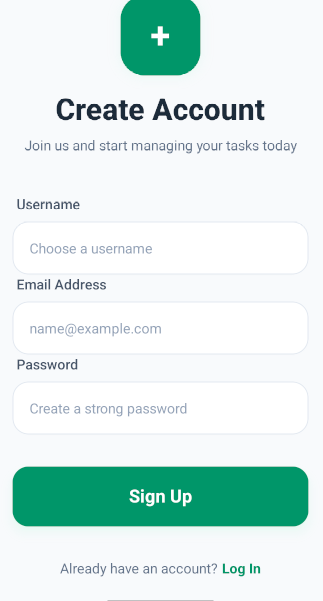
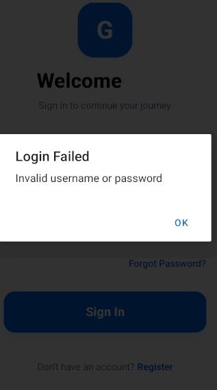
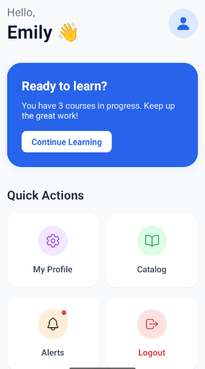
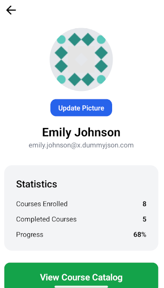
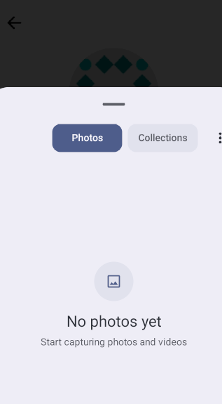

Mini LMS Mobile App (React Native Expo)

Hey 👋
This is a production-ready Mini LMS mobile application built using React Native Expo + TypeScript as part of a developer assessment.

The app demonstrates real-world mobile development practices including authentication, WebView integration, offline handling, notifications, and performance optimization.

🚀 Overview

This project focuses on:

Bridging native & web content (WebView)
Managing secure authentication & persistence
Building scalable and optimized UI
Handling real-world edge cases (offline, errors, retries)


✨ Features

🔐 Authentication
Login & Register using API
Secure token storage using Expo SecureStore
Auto-login on app restart
Logout functionality
Invalid login handling


📚 Course Catalog
Fetch courses & instructors from API
Search courses by title
Bookmark functionality
Pull-to-refresh
Optimized rendering using LegendList


📖 Course Details
Detailed course screen
Instructor info
Bookmark toggle
Enroll button (UI)


🌐 WebView Integration
Dynamic course content rendering
Native → WebView data passing
Custom HTML template rendering


🔔 Notifications
Permission handling (Allow / Deny)
Notification on bookmarking 5+ courses
Inactive user reminder (24 hours)
Navigation via notification click


📶 Offline Support
Network detection using NetInfo
Offline banner UI
Graceful API failure handling
⚡ Performance Optimization
Used LegendList for better performance
Memoization using useCallback
Clean modular architecture
🧱 Tech Stack
React Native (Expo SDK)
TypeScript (Strict Mode)
Expo Router
Zustand (State Management)
NativeWind (Styling)
Expo SecureStore
AsyncStorage
Expo Notifications
NetInfo
LegendList


## 📱 Screenshots

### 🔐 Authentication




### 🏠 Dashboard & Courses



### 📖 Course Content


### 🔔 Notifications


### 👤 Profile




# 🚀 Project Setup (Run Locally)

Follow these steps to run the app on your local machine.

---

## 📦 Prerequisites

Make sure you have installed:

* Node.js (v18 or later)
* npm or yarn
* Git
* Android Studio (for emulator)

---

## 📥 Clone the Repository

```bash
git clone https://github.com/raj81040/react-native-course-app.git
cd react-native-course-app
```

---

## 📦 Install Dependencies

```bash
npm install
```

---

## ▶️ Run the App (Expo)

Start the development server:

```bash
npx expo start --go
```

---

## 📱 Run on Android Emulator

* Open Android Studio
* Start an emulator
* Press `a` in terminal

---

## 📱 Run on Physical Device

* Install Expo Go app from Play Store
* Scan the QR code shown in terminal/browser

---

## ⚠️ Important Notes

* This project uses **Expo**
* Push notifications **do NOT work in Expo Go (SDK 53+)**
* To test notifications, you need a **development build**

---

## 🔧 (Optional) Run with Development Build

```bash
npm install -g eas-cli
eas login
eas build:configure
eas build -p android --profile development
```

Install the generated APK and then run:

```bash
npx expo start
```

---

## 🧹 Clear Cache (if errors occur)

```bash
npx expo start --clear
```

---

## 📂 Project Structure (Basic)

```
react-native-course-app/
│── app/
│── assets/
│── components/
│── node_modules/
│── package.json
```

---

## 💡 Common Issues

### Notifications not working

* Works only on real device + development build

### App not opening on emulator

```bash
adb devices
```

Make sure emulator is running.

---

## 👨‍💻 Author

Raj Tiwari
